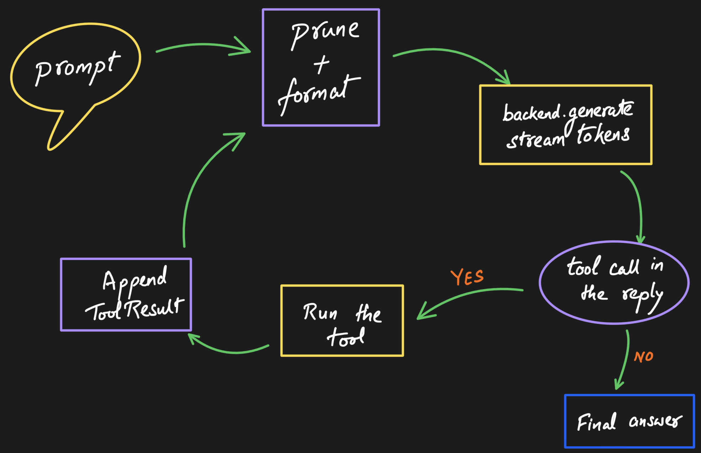

The `Agent` struct is the main entry point. It owns the conversation state and
drives the prompt → LLM → response loop.



*One call to `prompt` drives the whole cycle, looping on tool calls until the
model returns a tool-free answer (bounded by `max_tool_iterations`, default 8).*

## Creating an agent

```rust
use orion_core::{Agent, AgentConfig, InferenceParams, ContextConfig};

let mut agent = Agent::new(AgentConfig {
    system_prompt: "You are a coding assistant.".into(),
    inference_params: InferenceParams {
        max_tokens: 4096,
        temperature: 0.4,
        context_size: 8192,
        n_threads: 6,
    },
    context_config: ContextConfig {
        max_context_tokens: 8192,
        max_response_tokens: 4096,
        ..Default::default()
    },
    ..Default::default()
});
```

`AgentConfig` carries the system prompt, inference parameters, context
configuration, and `max_tool_iterations` (the cap on tool-loop rounds, default
8). Everything has a sensible `Default`, so `Agent::new(AgentConfig::default())`
is a valid starting point.

## Running a turn

There are two ways to drive a turn:

- **`agent.prompt(text, backend, tx)`** - you create the
  `mpsc::unbounded_channel::<AgentEvent>()` and pass the sender. The agent
  streams events into it and returns when the turn is done.
- **`agent.prompt_stream(text, backend)`** - the agent creates the channel for
  you and returns `(receiver, future)`. Drive the future while you drain the
  receiver.

Both run the full context → generate → tool loop described in
[Architecture](../architecture/).

## Changing settings on the fly

```rust
agent.set_system_prompt("You are a pirate.");
agent.set_inference_params(InferenceParams { temperature: 1.2, ..Default::default() });
```

## Managing the conversation

```rust
agent.clear();                          // Reset the conversation
agent.replace_messages(saved_messages); // Restore a saved conversation
```

Because conversation state is just a `Vec<Message>`, you can persist it and
restore it later with `replace_messages` - useful for resuming sessions.

## Aborting a generation

```rust
agent.abort();
```

`abort` signals the shared `AtomicBool` the backend checks each token, so a
running generation stops promptly and the call returns with
[`CoreError::Aborted`](../errors/).

## Tools and templates

The agent also owns the registered tools and the active chat template:

- `agent.set_tools(vec![Box::new(MyTool)])` - see [Tools](../tools/).
- `agent.set_approval_hook(Arc::new(MyHook))` - authorize tool calls before they
  run; see [Gating tool calls](../tools/#gating-tool-calls).
- `Agent::with_template(config, template)` / `agent.set_template(template)` -
  see [Templates](../templates/).
