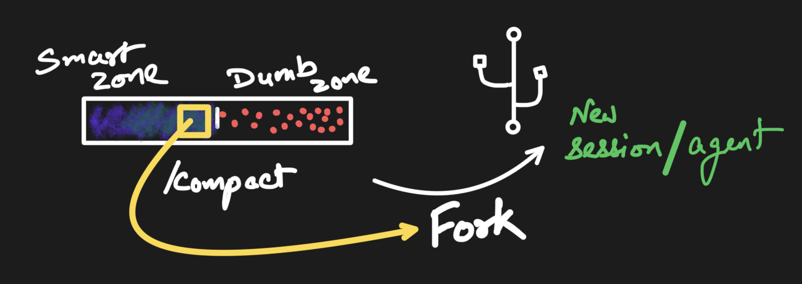

The context module handles the hard problem of fitting a conversation into a
fixed-size context window. The agent runs it automatically before each LLM
call, so you rarely call it directly — but understanding it explains the
`ContextBudget` events and the pruning behavior.



*Attention isn't uniform across the window: there's a smart zone early and a
dumb zone as it fills. Pruning and summarization keep what matters in the part
the model actually reads.*

## What it does

1. **Prunes** old messages when the conversation exceeds the token budget.
2. **Formats** the surviving messages into a prompt string with the active
   [chat template](../templates/).
3. **Reports** how many tokens are used and how many messages were pruned.

```rust
use orion_core::ChatMLTemplate;
use orion_core::context::{prepare_context, ContextConfig};

let token_counter = |text: &str| -> u32 { /* your tokenizer */ 0 };

// Prune to fit the budget *and* format with a chat template in one step.
let prepared = prepare_context(
    &ChatMLTemplate,        // any `ChatTemplate` impl
    "You are helpful.",     // system prompt
    &messages,              // full conversation history
    &tool_schemas,          // tool schemas to inject (may be empty)
    &ContextConfig::default(),
    &token_counter,
)?;

// `prepared.prompt` is the formatted string to feed your backend.
println!(
    "{} tokens, {} kept, {} pruned",
    prepared.token_count, prepared.messages_included, prepared.messages_pruned,
);
```

## Prune strategies

Set via `ContextConfig::prune_strategy`:

- **`SlidingWindow`** (default) — drop the oldest turns first to fit the budget.
  Keeps the system prompt and the most recent messages.
- **`Summarize`** — before pruning, the agent folds the oldest overflowing
  turns into a single **pinned** summary message (one extra backend call), so
  their gist survives instead of being dropped. Prior summaries are
  consolidated, so exactly one accumulates. It's best-effort: if summarization
  fails, it falls back to the sliding window.

## Pinned messages

Any [`Message`](../messages/) with `pinned == true` always survives pruning,
regardless of budget or strategy:

```rust
let pinned = Message::user("id", "Important context").pinned();
// or toggle an existing message:
agent.set_pinned(message_id, true);
```

Pruning is turn-aware, so a pinned message keeps its whole turn — pinned
call/result pairs are never orphaned.

## The ContextBudget event

After each context prep, the agent emits a `ContextBudget` event with the
tokens used, the maximum, and how many messages were included versus pruned —
ideal for a live "context full" gauge in your UI. See [Events](../events/).
