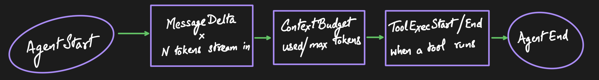

The agent emits events as it processes a turn. Subscribe to the
`AgentEvent` stream to build reactive UIs - stream tokens to the screen, show
tool progress, and render a live context-budget gauge.

Events arrive through an unbounded channel (`tokio::sync::mpsc`). You either
supply the sender to `agent.prompt(text, backend, tx)` or let
`agent.prompt_stream(text, backend)` create the channel for you.



*The shape of a turn: about a dozen typed events your UI subscribes to, so it
never has to reach inside the harness to know what's happening.*

## A simple prompt

```text
AgentStart
TurnStart
MessageStart    { user message }
MessageEnd      { user message }
ContextBudget   { used: 120, max: 4096, included: 5, pruned: 0 }
MessageDelta    { delta: "Hello", tokens: 1, tps: 45.2 }
MessageDelta    { delta: " there", tokens: 2, tps: 46.1 }
MessageDelta    { delta: "!", tokens: 3, tps: 44.8 }
GenerationStats { tokens_generated: 3, prompt_tokens: 120, ... }
MessageEnd      { assistant message }
TurnEnd         { message, tool_results: [] }
AgentEnd        { messages: [...] }
```

## A prompt with tool calls

When the model calls a tool, the agent runs it, feeds the result back, and
starts a new turn so the model can respond to it:

```text
AgentStart
MessageStart    { user message }
MessageEnd      { user message }
TurnStart
ContextBudget   ...
MessageDelta    ...
GenerationStats { tokens_generated, prompt_tokens, ... }
MessageEnd      { assistant message with tool_calls }
ToolExecStart   { tool_call_id, tool_name, args }
ToolExecUpdate  { partial progress }
ToolExecEnd     { result }
MessageStart    { tool_result message }
MessageEnd      { tool_result message }
TurnEnd         { message, tool_results: [...] }
TurnStart                            ← new turn: LLM responds to tool result
MessageDelta    ...
GenerationStats { ... }
MessageEnd      { final assistant message }
TurnEnd         { message, tool_results: [] }
AgentEnd        { messages: [...] }
```

If an [approval hook](../tools/#gating-tool-calls) denies a call, `ToolDenied`
takes the place of the `ToolExecStart` / `ToolExecUpdate` / `ToolExecEnd` trio -
the tool never runs, but a tool-result message (marked `is_error`) is still
appended so the model sees the refusal and the loop continues.

## All event types

| Event | When | Key data |
|-------|------|----------|
| `AgentStart` | Processing begins | - |
| `AgentEnd` | All done | All new messages |
| `TurnStart` | New LLM call begins | - |
| `TurnEnd` | LLM call + tools done | Assistant message, tool results |
| `MessageStart` | Any message added | Full message |
| `MessageDelta` | Each streamed token | `delta`, `tokens_generated`, `tokens_per_sec` |
| `GenerationStats` | Each completed LLM generation | `tokens_generated`, `prompt_tokens`, timing |
| `MessageEnd` | Message complete | Full message |
| `ToolExecStart` | Tool begins running | Tool name, args |
| `ToolExecUpdate` | Tool streams progress | Partial output |
| `ToolExecEnd` | Tool finished | Result, `is_error` |
| `ToolDenied` | Approval hook blocked a call | Tool name, `reason` |
| `ContextBudget` | After context prep | Tokens used/max, messages included/pruned |
| `Warning` | Non-fatal issue | Warning text |
| `Error` | Fatal error | Error text |

## Metering usage with `GenerationStats`

Exactly one `GenerationStats` is emitted per completed LLM generation within a
`prompt()` call, always before that turn's `MessageEnd` and before the closing
`AgentEnd`. When tools fire, a single `prompt()` spans several generations, so
**summing** the `tokens_generated` / `prompt_tokens` across every
`GenerationStats` in a run yields the exact per-run totals - no gaps, no double
counting. This contract is pinned by tests, so cost dashboards and quotas can
rely on it. (A generation that aborts or errors before completing produces no
result and so emits no `GenerationStats`.)

## Match with a wildcard arm

`AgentEvent` is `#[non_exhaustive]`. Always include a `_ => {}` arm so new
variants in a future minor release don't break your build:

```rust
while let Some(event) = rx.recv().await {
    match event {
        AgentEvent::MessageDelta { delta, .. } => print!("{delta}"),
        AgentEvent::Error { message } => eprintln!("Error: {message}"),
        _ => {}
    }
}
```
